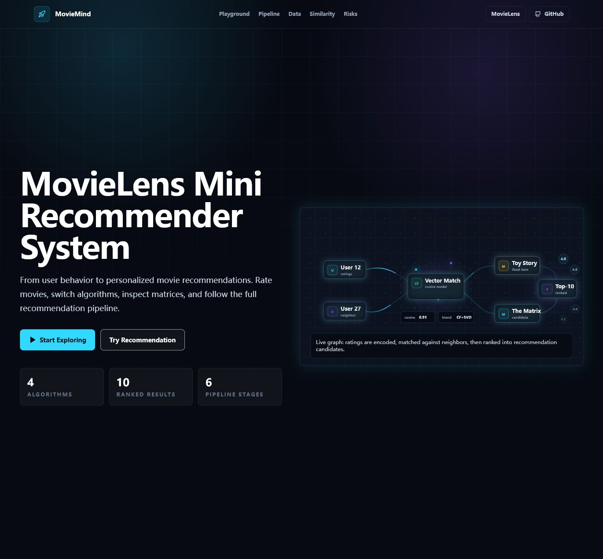

# 🎬 MovieMind

MovieMind is an interactive React + Vite single-page app that explains how a MovieLens-style recommender system turns rating behavior into personalized movie recommendations.

[Live Demo](https://dox-alpha.github.io/MovieMind/) · [Algorithm Notes](docs/algorithms.md) · [Risks & Limitations](docs/risks.md)



## ✨ Features

- Interactive recommendation playground with movie search, liked movies, 1-5 ratings, and Top-10 results.
- Four recommendation modes: Popularity, User-based CF, Item-based CF, and SVD-style latent factors.
- Human-readable recommendation reasons with scores and algorithm badges.
- Scroll narrative covering behavior data, rating matrices, similarity, recommendations, explanations, case studies, and risks.
- MovieLens data source dashboard with rating and genre distributions.
- User-item rating matrix heatmap and similarity analysis.
- GitHub Pages friendly demo mode using committed compact JSON.

## 🎯 Why It Matters

This project is designed as both a course deliverable and a portfolio project. The app does not only show recommendations; it also explains how recommendation signals are collected, transformed, compared, ranked, explained, and audited for product risk.

## 🚀 Quick Start

Install dependencies:

```bash
npm install
```

Start the dev server:

```bash
npm run dev
```

Build for production:

```bash
npm run build
```

Preview the production build:

```bash
npm run preview
```

## 🗂️ Project Structure

```text
MovieMind/
  docs/
    algorithms.md            # Algorithm explanation with diagrams
    risks.md                 # Recommendation risk notes
    assets/hero.png          # README screenshot
  public/data/demo/          # Committed compact demo JSON for instant playback
  public/data/generated/     # Local generated JSON output, ignored by Git
  data/raw/                  # Local-only raw MovieLens CSV files, ignored by Git
  scripts/prepare_movielens.py
  src/
    components/              # Hero graph, playground, narrative sections
    lib/                     # Data loading and recommender algorithms
    App.tsx
    main.tsx
    styles.css
```

## 📊 Data Strategy

This repository includes compact demo JSON so the app works immediately on GitHub Pages. It does not commit raw MovieLens CSV files or locally generated full-data JSON.

Raw MovieLens files should be downloaded directly from GroupLens:

[https://grouplens.org/datasets/movielens/](https://grouplens.org/datasets/movielens/)

Expected local raw files:

```text
data/raw/ml-latest-small/movies.csv
data/raw/ml-latest-small/ratings.csv
```

Generate local frontend JSON:

```bash
pip install pandas numpy scikit-learn
python scripts/prepare_movielens.py
```

The script writes:

```text
public/data/generated/movies.json
public/data/generated/ratings_sample.json
public/data/generated/user_item_matrix.json
public/data/generated/item_similarity.json
public/data/generated/user_similarity.json
public/data/generated/recommendations_demo.json
```

At runtime, the app first tries `public/data/generated/` and falls back to `public/data/demo/`.

## 🧠 Algorithms

MovieMind implements four recommender strategies:

- Popularity baseline
- User-based collaborative filtering
- Item-based collaborative filtering
- SVD-style latent factor scoring

For diagrams, implementation notes, and tradeoffs, see [docs/algorithms.md](docs/algorithms.md).

## ⚠️ Risks

The app also documents seven recommendation-system risks:

- Data sparsity
- Cold start
- Filter bubble
- Privacy exposure
- Interest fixation
- Popularity bias
- Low diversity

For explanations and mitigation ideas, see [docs/risks.md](docs/risks.md).

## 🌐 GitHub Pages

MovieMind can be hosted on GitHub Pages because it builds to static files. The online Pages version uses the committed demo JSON in `public/data/demo/`.

Enable Pages in:

```text
Settings -> Pages -> Build and deployment -> Source: GitHub Actions
```

The workflow at `.github/workflows/deploy.yml` builds the Vite app and deploys `dist/` whenever `main` is pushed.

## ✅ Course Deliverable Mapping

- Recommendation scenario: Hero, Playground, and Pipeline sections.
- Data source: Data Source section and data instructions.
- User-item rating matrix: Rating Matrix heatmap.
- Similar users/items: Similarity Analysis section.
- Recommendations for at least two users: Case Studies section.
- Recommendation basis: Top-10 cards and case-study explanations.
- Successful and wrong recommendations: Case Studies section.
- Limitations and risks: Limitations & Risks section and [docs/risks.md](docs/risks.md).

## 📦 Open-Source Notes

- Raw MovieLens data is ignored via `.gitignore`.
- Generated full-data JSON is ignored via `.gitignore`.
- Demo JSON is compact and intended for educational display.
- The project is suitable for GitHub Pages, Vercel, Netlify, or any static hosting provider after `npm run build`.
