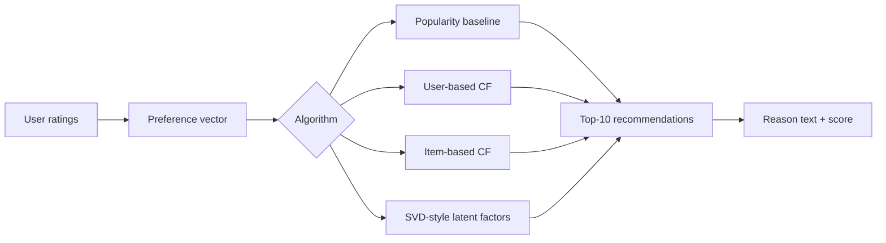
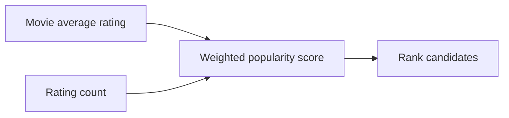

# Algorithm Notes

MovieMind uses four recommendation strategies so users can compare how different algorithms interpret the same rating behavior.

## Pipeline Overview

## 1. Popularity Baseline

### Core Idea

Recommend movies that are broadly well-liked and have enough ratings to be reliable.

### Inputs

- Movie average rating.
- Movie rating count.
- Movies the current user has not already selected.

### How MovieMind Uses It

The frontend ranks candidate movies by a weighted score that favors high ratings while also rewarding movies with more evidence. If the user has too few ratings, this algorithm is a stable fallback because it does not need a detailed personal profile.

### Strengths

- Fast and easy to explain.
- Good for cold-start users.
- Stable when user data is sparse.

### Weaknesses

- Not personalized.
- Can over-promote already popular movies.
- Poor at surfacing niche interests.

### Best Use Case

First-time users, anonymous visitors, or fallback recommendations when the system has low confidence.

## 2. User-Based Collaborative Filtering

### Core Idea

Find users with similar rating patterns, then recommend movies those similar users liked.

### Inputs

- Current user's selected movies and ratings.
- Sampled MovieLens user rating vectors.
- Candidate movies not already rated by the current user.

### How MovieMind Uses It

The app builds a pseudo-user vector from the current session, compares it with sampled users using cosine similarity, and scores movies based on ratings from the nearest users.

### Strengths

- Intuitive explanation: "similar users liked this."
- Can discover items outside one obvious genre.
- Works well when there is enough overlap between users.

### Weaknesses

- Sensitive to sparse data.
- Can be unstable when users have few shared ratings.
- Requires enough historical user behavior.

### Best Use Case

Users who have rated several movies that overlap with other users in the dataset.

## 3. Item-Based Collaborative Filtering

### Core Idea

Recommend movies similar to the movies the current user rated highly.

### Inputs

- Current user's rated movies.
- Precomputed item-item similarity.
- Candidate movies not already selected.

### How MovieMind Uses It

For each highly rated movie, the app looks up similar movies and combines similarity with the user's rating strength. This powers reasons such as "because you liked The Matrix."

### Strengths

- Stable and fast after preprocessing.
- Reasons are easy for users to understand.
- Works with fewer user ratings than user-based CF.

### Weaknesses

- Can over-focus on a narrow taste cluster.
- May recommend sequels or near-duplicates too often.
- Depends on good item similarity data.

### Best Use Case

Users with a few strong favorites where similarity-based explanations are useful.

## 4. SVD-Style Latent Factor Scoring

### Core Idea

Represent movies as latent vectors and score candidates by how close they are to the user's inferred taste vector.

### Inputs

- Latent movie factors exported by preprocessing.
- Current user's selected movies and ratings.
- Candidate movie latent vectors.

### How MovieMind Uses It

The preprocessing script exports item latent factors. The frontend estimates a user taste vector from the rated movies and scores candidate movies by vector similarity.

### Strengths

- Can capture hidden taste dimensions beyond direct genre labels.
- Scales better for larger datasets.
- Often improves ranking quality when enough data exists.

### Weaknesses

- Less transparent than similarity-based explanations.
- Sensitive to preprocessing choices.
- Harder to explain to non-technical users.

### Best Use Case

Larger datasets with enough interaction history and mixed user interests.

## Comparison Table

| Algorithm | Personalization | Explainability | Cold-start behavior | Main risk |
| --- | --- | --- | --- | --- |
| Popularity | Low | High | Strong | Popularity bias |
| User-based CF | Medium | Medium-high | Weak | Sparse overlap |
| Item-based CF | Medium-high | High | Medium | Narrow similarity loops |
| SVD-style | High | Medium-low | Weak-medium | Lower transparency |

## Implementation Files

- `src/lib/recommender.ts`: frontend scoring logic.
- `scripts/prepare_movielens.py`: preprocessing, similarities, latent factors, and generated JSON.
- `public/data/demo/`: compact committed demo data.
- `public/data/generated/`: local full-data output, ignored by Git.
