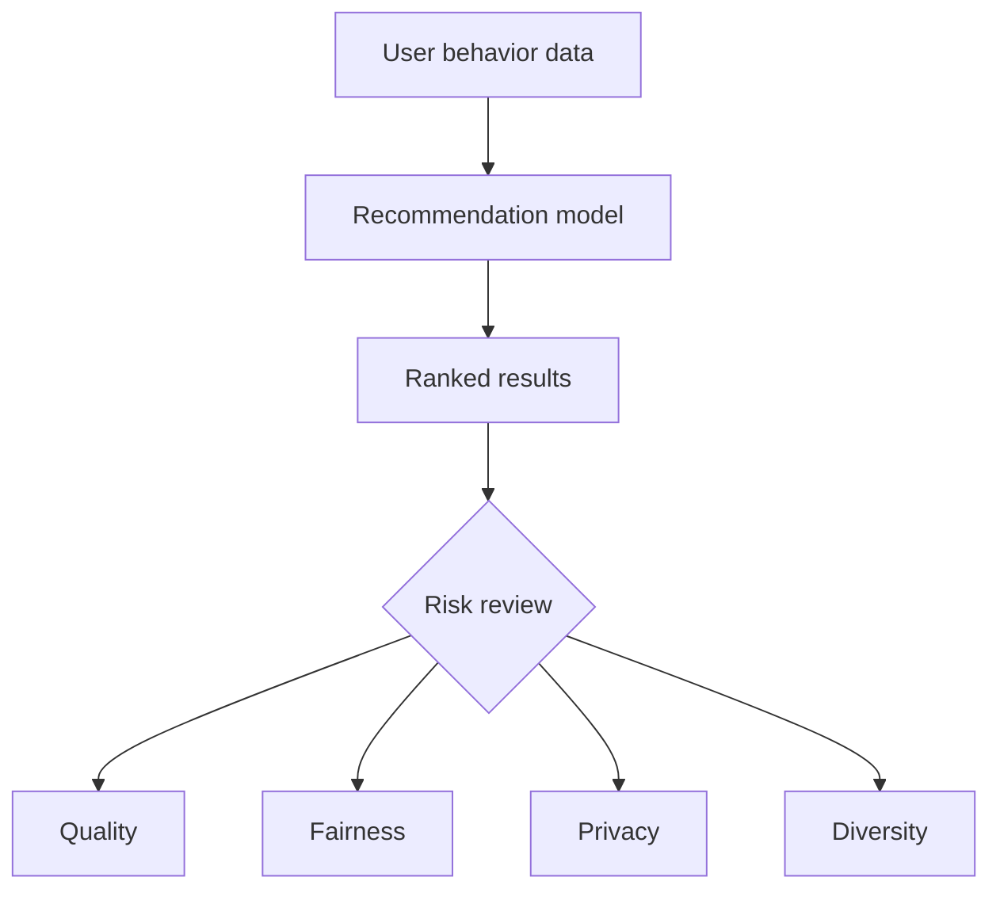

# Recommendation Risks & Limitations

Recommendation systems are product decisions, not only ranking formulas. MovieMind includes a risks section because a technically plausible recommendation can still create a poor user experience.

## 1. Data Sparsity

### What It Means

Most users rate only a small fraction of available movies, so the user-item matrix is mostly empty.

### Why It Happens

Movie catalogs are large, but individual users interact with only a few items.

### How It Appears In MovieMind

The Rating Matrix section shows many empty cells. Sparse overlap makes user similarity less reliable.

### Possible Mitigations

- Ask users for a few seed ratings during onboarding.
- Combine collaborative filtering with content features such as genre.
- Use popularity fallback when confidence is low.

## 2. Cold Start

### What It Means

The system has little or no data for a new user or a new movie.

### Why It Happens

Collaborative filtering depends on historical interactions. New entities have not accumulated enough signals.

### How It Appears In MovieMind

If the user provides too few ratings, recommendation confidence should be lower and the app blends toward popularity.

### Possible Mitigations

- Use onboarding questions.
- Recommend popular or diverse starter items.
- Use movie metadata for new items.

## 3. Filter Bubble

### What It Means

The system keeps recommending similar content, reducing exploration.

### Why It Happens

Algorithms optimize for predicted preference, often favoring items close to previous behavior.

### How It Appears In MovieMind

Item-based CF may repeatedly recommend movies close to the same liked movie cluster.

### Possible Mitigations

- Add diversity constraints to the Top-10 list.
- Mix in exploratory recommendations.
- Show users why an item appears and let them adjust taste signals.

## 4. Privacy Exposure

### What It Means

Ratings can reveal sensitive preferences, identity signals, or personal patterns.

### Why It Happens

Recommendation systems store behavioral data, and behavior can be identifying even without explicit personal information.

### How It Appears In MovieMind

The project uses demo JSON and local-only raw data to avoid exposing real user-level raw MovieLens files.

### Possible Mitigations

- Minimize stored user data.
- Aggregate or anonymize behavior.
- Avoid publishing raw user-item interaction files.
- Explain data usage clearly.

## 5. Interest Fixation

### What It Means

The system may keep reinforcing old interests even when user preferences change.

### Why It Happens

Historical ratings can dominate the user profile if the model does not adapt.

### How It Appears In MovieMind

A few high-rated movies can strongly influence Item-based CF and SVD-style scores.

### Possible Mitigations

- Weight recent behavior more heavily.
- Let users remove or downweight old signals.
- Include multiple taste clusters in a ranked list.

## 6. Popularity Bias

### What It Means

Popular movies receive more exposure, which can make them even more popular.

### Why It Happens

Ratings and interaction counts are not evenly distributed. Algorithms often reward items with more evidence.

### How It Appears In MovieMind

The Popularity algorithm intentionally ranks by broad appeal, making it useful but less personalized.

### Possible Mitigations

- Add long-tail boosts.
- Reserve slots for niche recommendations.
- Compare popularity and personalized algorithms side by side.

## 7. Low Diversity

### What It Means

A list can have high predicted scores but still feel repetitive.

### Why It Happens

Ranking by score alone can select many items from the same genre, franchise, or similarity cluster.

### How It Appears In MovieMind

The Top-10 list may contain several movies explained by the same liked item.

### Possible Mitigations

- Limit repeated genres or franchises.
- Re-rank results with a diversity penalty.
- Show a balanced mix of safe picks and exploratory picks.

## Practical Takeaway

A recommender should not only ask "What will the user like?" It should also ask:

- How confident is this score?
- Is the list diverse enough?
- Can the user understand the reason?
- Is the data safe to expose?
- Does the system help discovery rather than only repeating history?
